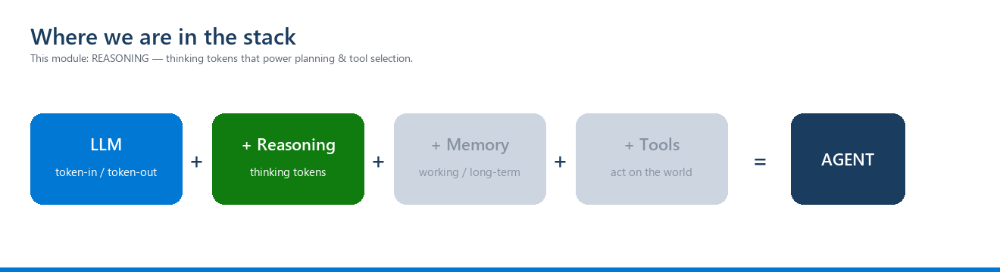

<!-- JHF-BRAND -->
<div align="center" style="padding:28px 20px; background:#ffffff; border:2px solid #e0e0e0; border-radius:12px;">
  <p style="margin:0 0 16px 0;">
    
    
  </p>
  <h1 style="color:#1a3c5e; margin:6px 0;">Agentic AI Bootcamp</h1>
  <h3 style="color:#0078d4; margin:4px 0; font-weight:600;">Module 0 &middot; LLM &amp; Reasoning Primer &mdash; Lab Worksheet</h3>
  <hr style="border:0; border-top:1px solid #0078d4; width:60%; margin:16px auto;" />
</div>

# M0 Lab — Feel the model before you build the agent

> **Goal:** in ~30 minutes, *experience* the four ideas from the handout — tokens, context window, temperature, and reasoning — so the rest of the course rests on intuition, not faith.
> **You need:** your `OPENROUTER_API_KEY` from the M1 Pre-Work (same key). No agent frameworks.



---

## Setup (2 min)
```bash
pip install openai python-dotenv
```
`.env` (git-ignored): `OPENROUTER_API_KEY=sk-or-...`

```python
import os
from dotenv import load_dotenv
from openai import OpenAI
load_dotenv()
client = OpenAI(api_key=os.environ["OPENROUTER_API_KEY"], base_url="https://openrouter.ai/api/v1")
```

## Exercise 1 — Tokens in, tokens out (5 min)
Call the model once and print the **usage** object.
```python
r = client.chat.completions.create(
    model="openai/gpt-4o-mini",
    messages=[{"role":"user","content":"Explain what a token is in one sentence."}],
)
print(r.choices[0].message.content)
print("TOKENS:", r.usage)   # note prompt_tokens + completion_tokens = total_tokens
```
✍️ **Record:** prompt vs completion tokens. *This is the "function: tokens in → tokens out".*

## Exercise 2 — Statelessness (5 min)
Prove a plain LLM has **no memory** across calls.
```python
client.chat.completions.create(model="openai/gpt-4o-mini",
    messages=[{"role":"user","content":"My favorite animal is the flamingo."}])
r = client.chat.completions.create(model="openai/gpt-4o-mini",
    messages=[{"role":"user","content":"What is my favorite animal?"}])
print(r.choices[0].message.content)   # it does NOT know
```
Now give it memory the only way a plain LLM can — **put the history in the prompt**:
```python
r = client.chat.completions.create(model="openai/gpt-4o-mini", messages=[
    {"role":"user","content":"My favorite animal is the flamingo."},
    {"role":"assistant","content":"Noted — flamingos!"},
    {"role":"user","content":"What is my favorite animal?"}])
print(r.choices[0].message.content)   # now it "remembers"
```
✍️ **Record:** the model didn't *recall* — you *re-fed* the history. **That's short-term memory (M6).**

## Exercise 3 — Temperature (5 min)
Run the same creative prompt at `temperature=0` (twice) and `temperature=1.2` (twice).
```python
for t in (0, 0, 1.2, 1.2):
    r = client.chat.completions.create(model="openai/gpt-4o-mini", temperature=t,
        messages=[{"role":"user","content":"Invent a name for a coffee shop."}])
    print(t, "->", r.choices[0].message.content)
```
✍️ **Record:** `temperature=0` repeats; `1.2` varies. *This is why agent labs pin `temperature=0` for reliable decisions.*

## Exercise 4 — Reasoning vs plain (10 min)
Ask a multi-step question of a **plain** model and a **reasoning** model and compare.
```python
q = "A shop sells pens at 3 for $2. I have $10. How many pens can I buy, and how much change? Think step by step."
for model in ("openai/gpt-4o-mini", "openai/o4-mini"):   # swap for any reasoning model your key supports
    r = client.chat.completions.create(model=model, messages=[{"role":"user","content":q}])
    print("\n===", model, "===\n", r.choices[0].message.content)
```
✍️ **Record:** does the reasoning model show more reliable step-by-step working? Note the **latency** difference.

> If your key doesn't have a reasoning model, compare `temperature=0` with an explicit *"think step by step"* prompt vs. without it — same lesson.

---

## Deliverable (bring to M1)
A short `m0_notes.md` with your recorded observations for all 4 exercises, and one sentence each:
- What is an LLM? · Why is it stateless? · Why temperature=0 for agents? · When is a reasoning model worth it?

## Grading (formative, ungraded gate)
✅ You're ready for M1 when all four cells ran and you can explain **statelessness** in your own words.

---

<div align="center" style="padding:14px; border-top:2px solid #0078d4; margin-top:30px;">
  
  
  <p style="color:#888; font-size:12px; margin-top:8px;">JHF Agentic AI Bootcamp &mdash; Module 0 Lab &middot; Organized by JHF &middot; in partnership with COMCEC</p>
</div>
