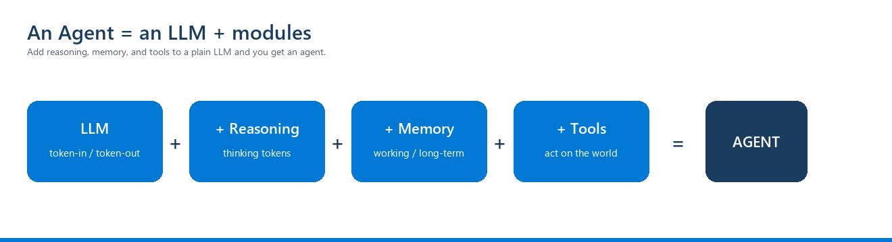

<!-- JHF-BRAND -->

  

    
    
  

  <h1 style="color:#1a3c5e; margin:6px 0;">Agentic AI Bootcamp</h1>
  <h3 style="color:#0078d4; margin:4px 0; font-weight:600;">Module 0 &middot; LLM &amp; Reasoning Primer &mdash; Learner Handout</h3>
  

  
Foundations &middot; primer (do before M1) &nbsp;|&nbsp; ~45–60 min &nbsp;|&nbsp; no agent code yet

# Module 0 — LLM & Reasoning Primer

> **Why this module exists.** The rest of the bootcamp builds an **agent by adding modules to an LLM**. Before we add memory and tools, we need a shared, correct picture of the thing we're augmenting: the **LLM**, and its newer sibling, the **reasoning LLM**. This primer gives you that picture in plain language — no agent code yet.
>
> *Book alignment: this primer condenses the foundations the reference book (**An Illustrated Guide to AI Agents**, M. Grootendorst) builds in **Ch. 2 "The LLM"** and **Ch. 3 "Reasoning LLMs"** before it ever reaches memory, tools, or agents.*

> **The one picture for the whole course.** You will see this diagram at the start of several modules, with the current piece lit up. Everything we build is **"a plain LLM + one more capability."**

---

## 1. An LLM is a function: tokens in → tokens out

Strip away the hype and a large language model is a **function**: it takes a sequence of **tokens** (chunks of text) and predicts the next tokens, one at a time.

- It does **not** browse the web, run code, or remember you between chats — **by itself**.
- Hosted assistants (ChatGPT, Claude, Copilot) *feel* like they do those things because they are **LLMs wrapped with extra modules** (memory, tools) — exactly what this course builds.

> **Key idea (we'll reuse it all course):** *"An LLM is a function that takes tokens and returns tokens."* To improve its output you either **train the model** or **improve what you feed it** (its context).

## 2. The context window (why size matters)

The LLM can only "see" a limited number of tokens at once — its **context window** (input **and** output combined). Think of it as the model's desk: everything it can consider must fit on the desk.

- A small query + answer might be ~13 tokens; a window might be 8,192 — or millions in newer models.
- As a conversation grows, tokens pile up. Overflow the window and the model **truncates** or **fails**.
- **More is not better:** stuffing the window degrades quality (you'll meet "lost-in-the-middle" and "context rot" in **M6**). Managing the window well is a whole discipline — **context engineering** (M6).

## 3. How an LLM "decides": probabilities & temperature

The model outputs a **probability** for each possible next token and samples from them.

- **Temperature ≈ 0** → almost always pick the most likely token → **deterministic**, good for tool-calling and structured output (we use `temperature=0` in labs).
- **Higher temperature** → more randomness → good for brainstorming, worse for reliability.

That's why our agent labs pin `temperature=0`: we want **repeatable decisions**, not creativity.

## 4. Parametric memory (what the model already "knows")

Ask an LLM "What's the capital of France?" and it answers "Paris" — that fact lives in its **weights** (**parametric memory**), learned during training. But:

- It's **frozen** at training time (no knowledge of today's events).
- It's **unreliable** for specifics (it may confidently make things up — a **hallucination**).

That's the motivation for **memory & retrieval** (M6): give the model fresh, trustworthy facts at run time instead of trusting its weights.

## 5. Reasoning LLMs: "thinking tokens"

A **reasoning LLM** is trained to spend extra tokens **thinking step-by-step before answering** (you may see `<think>…</think>` traces). Why you care:

- Better at **planning** multi-step tasks (M3).
- Better at **tool selection** — deciding *which* tool to use and *how* (M5). The book repeatedly notes that good tool selection "is where reasoning LLMs shine."
- Trade-off: thinking tokens cost **money and latency** — a recurring theme (M11).

> **Rule of thumb:** simple lookup → any model; multi-step decision, planning, or many tools → a reasoning model.

## 6. Prompt vs context (a preview of M6)

- **Prompt engineering** = wording the user/system message well.
- **Context engineering** = optimising the **whole** input (system prompt + history + retrieved facts + tool definitions). The course treats this as a first-class skill in **M6**.

---

## Check-your-understanding (bring answers to M1)
1. Complete the sentence: *"An LLM is a function that takes ___ and returns ___."*
2. Why can't a plain LLM (with no extra modules) remember your name across two separate chats?
3. You need an agent to reliably emit valid JSON tool calls. Do you set temperature high or low, and why?
4. Give one task where a **reasoning** model is worth the extra cost, and one where it isn't.
5. In one line: what's the difference between **prompt** engineering and **context** engineering?

## What's next
In **M1** we take this LLM and wrap it in the smallest possible **agent loop** — *the model decides, your code executes* — the first module lighting up on the diagram above.

---

  
  
  
JHF Agentic AI Bootcamp &mdash; Module 0 Primer &middot; Organized by JHF &middot; in partnership with COMCEC

