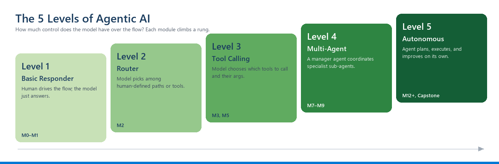

<!-- JHF-BRAND -->
<div align="center" style="padding:28px 20px; background:#ffffff; border:2px solid #e0e0e0; border-radius:12px;">
  <p style="margin:0 0 16px 0;">
    
    
  </p>
  <h1 style="color:#1a3c5e; margin:6px 0;">Agentic AI Bootcamp</h1>
  <h3 style="color:#0078d4; margin:4px 0; font-weight:600;">Module 1 &middot; What Agentic AI Really Is &mdash; Learner Handout</h3>
  <hr style="border:0; border-top:1px solid #0078d4; width:60%; margin:16px auto;" />
  <p style="font-size:14px; color:#555; margin:6px 0;">
    <strong>Lead Trainer</strong><br/>
    <a href="https://www.linkedin.com/in/alaaldin-ahmed-260266150" target="_blank">Alaaldin Ahmed</a>
  </p>
  <p style="font-size:12.5px; color:#777; margin:8px 0 0 0;">
    Organized by <strong>Jerusalem High-Tech Foundry (JHF)</strong> &nbsp;&middot;&nbsp; In partnership with <strong>COMCEC</strong>
  </p>
</div>

# Module 1 — What Agentic AI Really Is
## Learner Handout

> **Duration:** 4 hours · **You need:** Python 3.11+, an LLM API key, your editor with GitHub Copilot enabled.
> By the end of today you will have **built an autonomous agent from scratch** in plain Python — no frameworks.


> **The map for the whole course.** Everything we build is a **plain LLM + one more capability**. Today we wrap the LLM (from M0) in the smallest possible **agent loop** — *the model decides, your code executes.* Over the next modules the **reasoning**, **memory**, and **tools** boxes light up one by one.

---

## Learning Objectives

After this module you can:
1. Tell the difference between a **single LLM call**, a **workflow**, and an **autonomous agent**.
2. Describe the **agent loop** and its stopping condition.
3. Explain **when not to use an agent**.
4. **Build** a working, framework-free agent loop that uses a tool, loops, and stops safely.

---

## 1. The Agency Spectrum

"Agentic AI" is not "AI that's smart." It's about **who decides the next step**.

> 🧠 **Mental model — the agent's anatomy.** Everything you build in this course fits one picture:
> **Agent = Brain (the LLM) + Planning + Memory + Tools**, tied together by a **loop**.
> Today (M1) you build the **loop**; later modules fill in Planning (M3), Reflection (M4), Tools (M5), and Memory (M6). See **[MENTAL-MODELS.md](../MENTAL-MODELS.md)**.
>
> 👔 **Analogy — the project manager.** An agent is a project manager given a *goal*, not a script: it **understands** the goal, **plans** the steps, **delegates** to specialists (tools), **remembers** what's done, **checks** the result, and knows when to **stop**.

| Type | Who decides the steps? | Example | An agent? |
|---|---|---|---|
| **Single LLM call** | You, once | "Summarize this paragraph." | No |
| **Workflow / chain** | You, in advance (fixed order) | Summarize → translate → email | No — a pipeline |
| **Autonomous agent** | **The model, at runtime** | "Plan and book a 1-hour meeting room next week." | **Yes** |

**The dividing line:** an agent lets the *model* decide the control flow while running — choosing which action to take next based on what it has learned so far. A workflow has its steps fixed by the developer.

⚠️ **Myth:** "It uses a powerful LLM, so it's an agent." False. A chatbot that only answers is **not** an agent. Agency = the model **takes actions** and **observes results** to decide what to do next.

More agency means more capability — but also more **cost, latency, and unpredictability**. In 2026, most real systems are **constrained agents**: autonomy *inside* guardrails.

### The 5 Levels of Agentic AI (a finer ruler)

The three-way split above is the quick version. A more useful ruler has **five rungs** — from the model doing almost nothing to running fully on its own. We'll use it all course as a "**what level are we building?**" marker.



| Level | Name | Who controls the flow | You build it in |
|---|---|---|---|
| **1** | Basic Responder | Human drives everything; model just answers | M0–M1 |
| **2** | Router | Model picks among human-defined paths/tools | M2 |
| **3** | Tool Calling | Model decides which tools to call and their args | M3, M5 |
| **4** | Multi-Agent | A manager agent coordinates specialist sub-agents | M7–M9 |
| **5** | Autonomous | Agent plans, executes, and improves on its own | M12+, Capstone |

> *This ladder reconciles two sources — the "5 Levels" from the* Illustrated Guidebook *(Chawla & Pachaar) and the "Level 0–4" taxonomy from Google's* Introduction to Agents. *Written for this course; see `FURTHER-READING.md`.*

### Agent vs. Workflow — a quick decision checklist

> 🍳 **Analogy:** a workflow is a **recipe** (fixed steps); an agent is a **chef** (decides as it goes). Use the recipe when you can; hire the chef only when you must.

Answer these before building. **More "yes" → lean agent; mostly "no" → build a workflow** (cheaper, more reliable):

1. Are the steps **unknown in advance** or different every time?
2. Does the task need the system to **decide which tool/path** to use at runtime?
3. Will it need to **adapt** based on what it discovers mid-task?
4. Are there **many possible routes** to the goal (not one fixed pipeline)?
5. Is some **unpredictability acceptable** in exchange for flexibility?

> **Why this matters:** the most common beginner mistake is building an agent where a simple workflow would be cheaper, faster, and safer. Choosing correctly *is* good engineering.

---

## 2. The Agent Loop (the heart of everything)

Every agent — no matter the framework — runs some version of this loop:

```
   PERCEIVE → REASON → ACT → OBSERVE → (loop) → ... → DONE
```

```
        ┌─────────────────────────────────────────┐
        │                                           │
   ┌────▼─────┐   ┌────────┐   ┌────────┐   ┌───────▼────┐
   │ PERCEIVE │──▶│ REASON │──▶│  ACT   │──▶│  OBSERVE   │
   │ input +  │   │ decide │   │ call a │   │ tool result│
   │ context  │   │  next  │   │  tool  │   │ → context  │
   └──────────┘   └────────┘   └────────┘   └────────────┘
        ▲                                           │
        └───────────  loop until DONE  ─────────────┘
              (or step / cost budget hit)
```

- **Perceive** — gather the goal + current context (conversation, prior results).
- **Reason** — the LLM decides the next action, usually as JSON: `{"action": "calculator", "args": {"expr": "23*19"}}`.
- **Act** — **your code** runs the chosen tool. *The model never runs code — your harness does.*
- **Observe** — capture the result and add it back to the context so the next reasoning step is smarter.
- **Stop** — when the model emits a `final_answer`, **or** a hard cap (max steps / max cost) is hit.

> 🔑 **Separation of concerns:** the model **decides**, your harness **does**. Hold onto this — every framework in this bootcamp is just a fancier version of this split.

> 🔒 **Always** keep a hard stop (max steps / cost). Never trust the model to stop itself.

---

## 3. When NOT to Use an Agent

Reach for something simpler when:
- The steps are **known and fixed** → use a workflow (cheaper, deterministic, testable).
- You need **guaranteed determinism** (billing, compliance).
- It's **latency-critical and single-shot** → one LLM call is faster.
- The actions are **high-risk with no guardrails** → don't grant autonomy yet.

> Good engineering = using the *least* agency that solves the problem.

---

## 4. Cost & Token Economics (intro)

- Each loop step is **at least one LLM call**.
- Context **grows every step** (history piles up), so an N-step agent can cost **more than N×** a single call.
- Rule of thumb: *a 6-step agent ≈ 6×+ the cost of one call.*
- Two habits you'll use all bootcamp:
  1. **Step budget** (`max_steps`) — a hard ceiling on iterations.
  2. **Cost counter** — track tokens/calls so you *see* the price of autonomy.

---

## 5. Today's Lab (preview)

You'll build `agent_loop.py`: an agent that's given a question, decides whether to use a **calculator** tool or give a **final answer**, loops while feeding results back, and stops safely.

Full step-by-step instructions are in **`M1-Lab-Worksheet.md`**. Starter code is in **`starter-code/agent_loop_starter.py`**.

**Definition of done:** your agent solves *"What is (23 × 19) + 100, and is that more than 500?"* by choosing tools on its own (no hardcoded steps), and stops at a final answer.

---

## 6. Deliverables (graded)

1. **`agent_loop.py`** — your working agent (functionality + a `max_steps` cap + a cost counter).
2. **"Is this an agent?" note (1 page)** — classify the 3 systems below as *single call / workflow / agent*, with one sentence of justification each:
   - **(a)** A program that takes a support email and returns a drafted reply in one LLM call.
   - **(b)** A program that, given "research topic X," repeatedly searches, reads, and decides whether it has enough to write a summary — stopping when satisfied.
   - **(c)** A nightly job that fetches sales data, asks an LLM to summarize it, then always posts the summary to a channel.

> (Reflect before reading on: (a) single call, (b) agent, (c) workflow.)

---

## 7. Key Terms

| Term | Meaning |
|---|---|
| Agent | A system where the **model** chooses actions at runtime to pursue a goal. |
| Agent loop | Perceive → Reason → Act → Observe, repeated until done. |
| Tool | A function the agent can call to act on the world (calculator, API, search…). |
| Harness / orchestrator | The code that runs the loop and executes the chosen tools. |
| Stopping condition | What ends the loop: a final answer **or** a hard budget cap. |
| Step budget | Max iterations allowed — prevents runaway loops. |

---

## 8. Quiz (5 min — you'll self-check after)

1. What single property most distinguishes an agent from a workflow?
2. Name the four stages of the agent loop.
3. Who actually executes a tool — the model or your code?
4. Give one reason you must always have a hard step/cost cap.
5. Give one task where an agent is the WRONG choice, and why.
6. Why does agent cost tend to grow super-linearly with steps?
7. In the loop, what does "observe" mean concretely?
8. A program calls an LLM, then always translates, then always emails. Agent or not?

---

<div align="center" style="padding:14px; border-top:2px solid #0078d4; margin-top:34px;">
  <p style="margin:0 0 8px 0;">
    
    
  </p>
  <p style="color:#888; font-size:13px; margin:0;">
    <strong>JHF Agentic AI Bootcamp</strong> &mdash; Module 1<br/>
    Lead Trainer: <a href="https://www.linkedin.com/in/alaaldin-ahmed-260266150">Alaaldin Ahmed</a><br/>
    Organized by Jerusalem High-Tech Foundry (JHF) &middot; In partnership with COMCEC
  </p>
</div>

