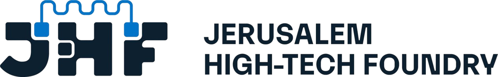
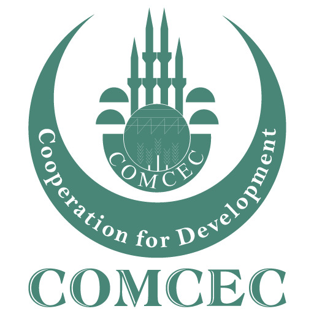

<!-- JHF-BRAND -->

  

    
    
  

  <h1 style="color:#1a3c5e; margin:6px 0;">Agentic AI Bootcamp</h1>
  <h3 style="color:#0078d4; margin:4px 0; font-weight:600;">Module 1 &middot; Post-Session Assignment &mdash; What Agentic AI Really Is</h3>
  

  

    <strong>Lead Trainer</strong> 
    <a href="https://www.linkedin.com/in/alaaldin-ahmed-260266150" target="_blank">Alaaldin Ahmed</a>
  

  

    Organized by <strong>Jerusalem High-Tech Foundry (JHF)</strong> &nbsp;&middot;&nbsp; In partnership with <strong>COMCEC</strong>
  

# Module 1 — Post-Session Assignment
## What Agentic AI Really Is

> **Complete AFTER the session, before Module 2.** Estimated time: **~60 minutes.**
> This **extends** today's lab (it does not repeat it). It consolidates the agent loop and primes you for M2.
> Feeds into: your understanding for the Phase 1 mini-project. Light-touch — focus on learning, not polish.

---

## Goal

Take the agent loop you built in class and make it **more capable and more robust** — proving you understand *why* each part exists, not just that it runs.

---

## Tasks

### 1. Add a second tool (core, ~25 min)
Extend your `agent_loop.py` so the model must choose among **three** actions: `calculator`, a new **`lookup`** tool (a small hardcoded dictionary, e.g., country → capital), and `final_answer`.
- The model should call `lookup` only when the question needs it, and `calculator` only for math.
- ✅ Test: *"What is the capital of France, and what is 12 × 12?"* — the agent should use **both** tools across separate steps, then answer.

### 2. Make it robust (core, ~20 min)
Add **two** of the following hardening features (your choice):
- **Bad-JSON retry:** if the model's action can't be parsed, retry once with a "respond with ONLY valid JSON" nudge before failing.
- **Loop detection:** if the agent repeats the identical action twice in a row, stop with a clear message.
- **Cost guard:** stop if total LLM calls exceed a budget you set, returning a graceful "couldn't finish in budget."

### 3. Reflect (short, ~15 min)
Write **5–8 sentences** answering:
- Where did your agent **almost** loop or misbehave, and which guard caught it?
- Give one concrete example where adding more tools made the agent **harder** to keep reliable. (This previews why we add structure in M3.)

---

## Deliverables
1. Your updated `agent_loop.py` (three tools + two robustness features).
2. A short `reflection.md` (the 5–8 sentences from Task 3).

---

## Acceptance Checklist
- [ ] The agent correctly routes to `lookup` vs `calculator` vs `final_answer`.
- [ ] A multi-tool question is solved across multiple steps (no hardcoded sequence).
- [ ] Two robustness features work (demonstrate each, e.g., feed it a tricky input).
- [ ] The reflection names a real failure mode you observed.

---

## Looking Ahead to M2
In the next module you'll stop hand-writing the loop and let **LangGraph** and **CrewAI** run it for you. Notice, as you do this assignment, **how much plumbing you're writing by hand** (parsing, routing, guards) — that's exactly what frameworks will take over.

> Stuck? Re-read §2 of the M1 Handout (the agent loop) and revisit the lab worksheet's troubleshooting table. Compare against `solution-code/agent_loop_solution.py` only after attempting it yourself.

---

  

    
    
  

  

    <strong>JHF Agentic AI Bootcamp</strong> &mdash; Module 1 Assignment 
    Lead Trainer: <a href="https://www.linkedin.com/in/alaaldin-ahmed-260266150">Alaaldin Ahmed</a> 
    Organized by Jerusalem High-Tech Foundry (JHF) &middot; In partnership with COMCEC
  

